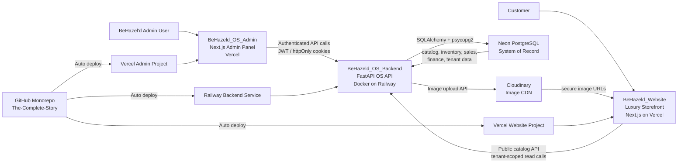

# BeHazel'd Technical Architecture Document

## 1. Executive Summary

The Complete Story is a headless commerce ecosystem for BeHazel'd. It separates the operational system of record from the customer-facing shopping experience:

- **Business Brain:** `BeHazeld_OS_Backend` and `BeHazeld_OS_Admin` manage products, variants, inventory, sales, finance, purchases, reporting, users, and tenant-scoped business data.
- **Customer Face:** `BeHazeld_Website/frontend` renders the luxury storefront and consumes public catalog data from the OS backend.
- **Cloud Foundation:** Railway hosts the FastAPI backend, Neon hosts PostgreSQL, Cloudinary hosts optimized product imagery, Vercel hosts the website and admin panel, and GitHub is the source for automated deployment.

This architecture allows internal operations to change product data once in the OS and have those updates flow to the storefront through public APIs. Product content, SKU logic, inventory records, sales history, and financial reporting stay centralized in the backend and database, while the storefront remains a fast, brand-focused experience.

## 2. System Architecture Diagram



## 3. Technology Stack

### Frontend

| Component | Technology | Hosting |
| --- | --- | --- |
| Storefront | Next.js, TypeScript, Tailwind CSS | Vercel |
| Admin OS | Next.js, TypeScript, Tailwind CSS, React Query-style hooks/server actions | Vercel |

### Backend

| Component | Technology | Hosting |
| --- | --- | --- |
| OS API | Python, FastAPI, SQLAlchemy, Pydantic, Uvicorn | Railway |
| Container Runtime | Docker, `python:3.11-slim`, `libpq-dev`, `gcc` | Railway Docker build |
| Auth | JWT access/refresh tokens, bcrypt password hashing, httpOnly cookies | Backend-managed |

### Data & Media

| Component | Technology | Purpose |
| --- | --- | --- |
| Database | PostgreSQL on Neon | Product, inventory, sales, finance, tenant, user, and audit data |
| DB Driver | `psycopg2-binary` | PostgreSQL connectivity through SQLAlchemy |
| Media | Cloudinary | Product and variant image storage, CDN delivery, secure URLs |

### CI/CD

| Source | Target |
| --- | --- |
| GitHub monorepo | Railway backend service |
| GitHub monorepo | Vercel admin deployment |
| GitHub monorepo | Vercel storefront deployment |

## 4. Detailed Component Breakdown

### `BeHazeld_OS_Backend`

The backend is the operational core of the system. It exposes versioned APIs under `/api/v1` and is organized by business domain:

- `auth`: Login, refresh, logout, current user profile.
- `admin`: Administrative tenant/user setup.
- `catalog`: Master data, products, variants, product images, CSV imports.
- `inventory`: Locations, bins, stock balances, stock movements.
- `sales`: Customers, sale bills, sale items, sales import and reporting workflows.
- `finance`: Accounting codes, journal entries, trial balance, profit and loss.
- `purchases`: Purchase views derived from purchase records and finance journals.
- `reports`: Executive dashboard and KPI-style reporting.
- `public`: Unauthenticated tenant-scoped product/category/customer endpoints for the storefront.
- `audit`: Operational audit trail.

Key backend architecture choices:

- **FastAPI application entry:** `app/main.py` registers middleware, exception handlers, health checks, and all routers.
- **Database session:** `app/db/session.py` normalizes provider URLs such as `postgres://` into PostgreSQL-compatible SQLAlchemy URLs and creates the engine with `pool_pre_ping=True`.
- **PostgreSQL driver:** `psycopg2-binary` replaces the former local MS SQL/ODBC approach.
- **Pydantic settings:** `app/core/config.py` reads runtime configuration from environment variables and `.env`.
- **Containerization:** The root `Dockerfile` installs Python dependencies from `BeHazeld_OS_Backend/requirements.txt`, sets `PYTHONPATH=/app/BeHazeld_OS_Backend`, and starts `uvicorn BeHazeld_OS_Backend.app.main:app`.
- **Cloudinary integration:** `app/services/image_service.py` uploads product and variant images and returns secure CDN URLs for storage in PostgreSQL.

### `BeHazeld_OS_Admin`

The admin panel is the operating interface for BeHazel'd. It is a Next.js application that talks to the backend through authenticated API calls.

Primary admin capabilities include:

- Catalog master data: product groups, product types, categories, brands, sizes, colors.
- Product and variant creation.
- SKU management and generated product codes.
- Product and variant image upload.
- Inventory locations, bins, stock movements, and stock ledger views.
- Sales entry, invoice generation workflow, customer management, and sales history.
- Finance account code import, journal entry import, manual journal entries, trial balance, profit and loss.
- Executive dashboard cards for revenue, COGS, gross profit, GST, active SKUs, and operating expenses.

Authentication behavior:

- `middleware.ts` protects admin routes by checking for an `access_token` cookie.
- `lib/api-client.ts` sends requests with `credentials: "include"`, parses backend error envelopes, and attempts a refresh token rotation on `401`.
- Server actions also read cookies and can refresh tokens before retrying API calls.

### `BeHazeld_Website`

The storefront is the luxury customer-facing site. The active storefront is `BeHazeld_Website/frontend`.

Primary storefront responsibilities:

- Render collection, product listing, product detail, cart, checkout, and brand pages.
- Fetch public catalog data from the OS backend instead of owning catalog state locally.
- Convert backend OS product shapes into the current storefront UI shape through `frontend/lib/os-catalog.ts`.
- Use `NEXT_PUBLIC_API_BASE_URL` and `NEXT_PUBLIC_TENANT_ID` to call tenant-scoped public APIs.

Current public API wiring:

- Storefront products: `GET /api/v1/public/{tenant_id}/products`
- Storefront categories/collections: `GET /api/v1/public/{tenant_id}/categories`
- Product detail: `GET /api/v1/public/{tenant_id}/products/{product_id}`

The storefront adapter maps:

- OS categories to storefront collections.
- OS product UUIDs to storefront product URLs.
- OS `image_url` fields to storefront product images.
- OS `sku_code`, `selling_price`, and variant image data into storefront variants.
- SKU code segments into user-facing color and size values where possible.

## 5. Data Pipeline & Logic

### Product Upload Flow

1. **Admin creates product/variant**
   - The admin panel submits product metadata to the catalog API.
   - Backend validates tenant, permissions, and references such as category, product group, size, color, and brand.
   - Product and variant rows are saved in Neon PostgreSQL.

2. **Admin uploads image**
   - Product image upload uses `POST /api/v1/catalog/products/{product_id}/image`.
   - Variant image upload uses `POST /api/v1/catalog/products/{product_id}/variants/{variant_id}/image`.
   - The backend receives the file as multipart form data.

3. **Backend sends image to Cloudinary**
   - `ImageService` uploads the image to Cloudinary under a tenant/product-specific folder.
   - Cloudinary returns a `secure_url`.

4. **Backend saves URL in Neon**
   - Product image URLs are saved on `catalog.products.image_url`.
   - Variant image URLs are saved on `catalog.product_variants.image_url`.

5. **Storefront displays the image**
   - The storefront fetches public product data.
   - `frontend/lib/os-catalog.ts` maps `image_url` into the storefront image structure.
   - Product cards and product detail pages render the Cloudinary CDN URL.

### Category and Section Filtering Logic

The backend has catalog categories as tenant-scoped master data. The storefront treats these as customer-facing collections:

1. Storefront calls `GET /api/v1/public/{tenant_id}/categories`.
2. Each category name is slugified into a storefront route, for example `Power Edit` becomes `power-edit`.
3. When a collection page opens, the storefront finds the matching category by slug.
4. Storefront then calls `GET /api/v1/public/{tenant_id}/products?category_id={category_uuid}`.
5. Backend filters active products by `category_id` and returns active variants.
6. Storefront adapts the response into product cards and detail pages.

This means a product appears on the correct website section when the product is assigned to the appropriate category in the admin OS.

### SKU and Variant Logic

The OS treats a product as the parent item and a variant as the sellable SKU. Product variants carry size, color, MRP, cost price, selling price, image URL, and status. Public storefront responses intentionally omit internal fields such as cost price.

SKU code generation is handled in the catalog repository/service layer. Product codes are derived from product naming logic, and SKU codes combine product code, color, and size. The storefront displays the public `sku_code` and parses common color/size tokens for customer-facing variant controls.

## 6. Infrastructure & Security

### Environment Management

Secrets and environment-specific values are kept out of source code and supplied through `.env`, Railway variables, or Vercel project variables.

Important backend variables:

```env
APP_ENV=production
DATABASE_URL=postgresql://...
JWT_SECRET_KEY=...
JWT_ALGORITHM=HS256
ACCESS_TOKEN_EXPIRE_MINUTES=30
REFRESH_TOKEN_EXPIRE_DAYS=7
CLOUDINARY_CLOUD_NAME=...
CLOUDINARY_API_KEY=...
CLOUDINARY_API_SECRET=...
ALLOWED_ORIGINS_RAW=https://admin-domain.vercel.app,https://storefront-domain.vercel.app
```

Important admin variables:

```env
NEXT_PUBLIC_API_URL=https://the-complete-story-production.up.railway.app
```

Important storefront variables:

```env
NEXT_PUBLIC_API_BASE_URL=https://the-complete-story-production.up.railway.app
NEXT_PUBLIC_TENANT_ID=<tenant_uuid>
```

### Authentication

Admin authentication is JWT-based:

- Passwords are hashed with bcrypt.
- Login issues access and refresh tokens.
- Tokens include user and tenant claims.
- Access tokens are short-lived.
- Refresh tokens are persisted and rotated.
- Reuse of a revoked refresh token revokes active sessions for that user.
- FastAPI sets `access_token` and `refresh_token` as httpOnly cookies.
- Admin API requests either use cookies or server-side bearer token forwarding from cookies.

Public storefront catalog endpoints are unauthenticated but tenant-scoped by `tenant_id` in the route.

### CORS

The backend enables CORS in `app/main.py` using `settings.ALLOWED_ORIGINS`, derived from the comma-separated `ALLOWED_ORIGINS_RAW` variable.

This allows the same backend to safely accept browser requests from:

- Local development origins such as `http://localhost:3000`.
- Vercel admin deployment domains.
- Vercel storefront deployment domains.
- Custom domains once configured.

Credentials are enabled because admin auth uses cookies.

## 7. Deployment Strategy

The project uses a GitHub monorepo:

```text
The Complete Story/
├── Dockerfile
├── ARCHITECTURE.md
├── BeHazeld_OS_Backend/
├── BeHazeld_OS_Admin/
└── BeHazeld_Website/
    └── frontend/
```

Each deployed service uses a different root/build target from the same repository:

### Backend on Railway

- Repository: `atanumazumdar/The-Complete-Story`
- Build mode: Dockerfile from repository root.
- Dockerfile copies backend requirements, installs Python dependencies, copies the monorepo, sets `PYTHONPATH`, and starts Uvicorn.
- Runtime service points to `BeHazeld_OS_Backend.app.main:app`.
- Health check: `/health`.
- Database: Neon PostgreSQL through `DATABASE_URL`.
- Media: Cloudinary through Cloudinary credentials.

### Admin OS on Vercel

- Repository: same monorepo.
- Root directory: `BeHazeld_OS_Admin`.
- Build: Next.js production build.
- Runtime environment points `NEXT_PUBLIC_API_URL` to the Railway backend.
- Auth is cookie-based and requires the backend domain in CORS.

### Storefront Website on Vercel

- Repository: same monorepo.
- Root directory: `BeHazeld_Website/frontend`.
- Build: Next.js production build.
- Runtime environment points `NEXT_PUBLIC_API_BASE_URL` to the Railway backend.
- `NEXT_PUBLIC_TENANT_ID` selects which tenant catalog the storefront should render.

### CI/CD Flow

1. Code changes are committed to GitHub.
2. Railway detects backend-relevant changes and rebuilds the Docker service.
3. Vercel detects admin/storefront changes and rebuilds the corresponding Next.js services.
4. The backend serves authenticated admin APIs and public storefront APIs.
5. Neon and Cloudinary remain external managed services, preserving data and media across deploys.

## 8. Operational Notes

- The backend is the source of truth for product, variant, inventory, sales, purchase, and finance data.
- The storefront should not duplicate catalog data; it should read through the public API.
- Product images should be uploaded through the admin OS so Cloudinary URLs are stored consistently.
- Admin and storefront Vercel domains must be added to `ALLOWED_ORIGINS_RAW`.
- The public storefront requires the correct tenant UUID at build/runtime.
- Internal financial and inventory views should remain authenticated and should not be exposed through public APIs.

